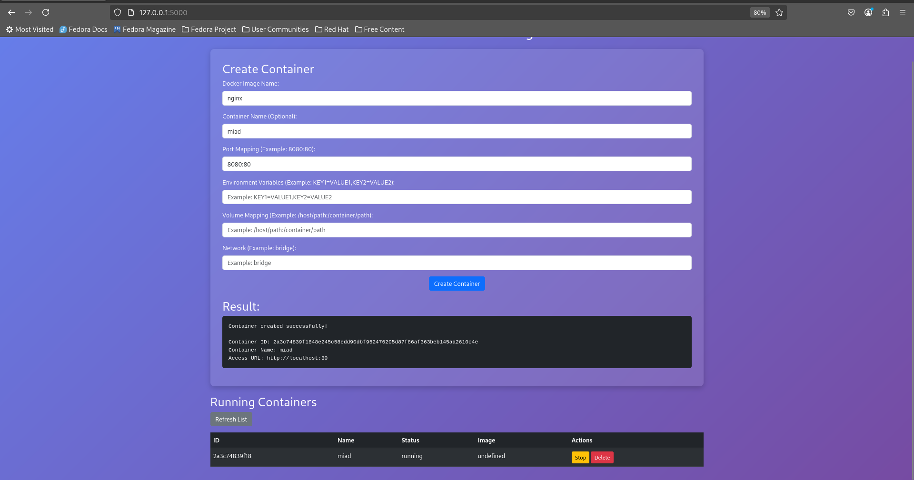

# Docker Container Manager

A simple Flask-based web application to manage Docker containers. Create, stop, and delete containers with ease!

## Features
- **Create Containers**: Start any Docker container with custom configurations.
- **List Containers**: View all running and stopped containers.
- **Stop Containers**: Stop running containers.
- **Delete Containers**: Remove containers permanently.
- **Flexible Configuration**: Supports ports, volumes, environment variables, and networks.

## Prerequisites
- Docker installed and running.
- Python 3.x.

## Installation
1. Clone the repository:
   ```bash
   git clone https://github.com/miaad-akbari/container-manager.git
   cd container-manager

### Install dependencies:

```
pip install -r requirements.txt
```
### Run the application:

```
python app.py
```
### Open your browser and go to:

```
http://localhost:5000
```
## Create a Container

### Fill in the form with the desired configuration.

* Click "Create Container".

* List Containers
The list of running and stopped containers will be displayed automatically.

* Stop a Container
Click the "Stop" button next to the container you want to stop.

* Delete a Container
Click the "Delete" button next to the container you want to remove.

## Examples
### Nginx
* Image Name: nginx

* Port Mapping: 8080:80

* Volume Mapping: /path/to/html:/usr/share/nginx/html

###  Apache HTTP Server 

* Docker Image Name: httpd

* Port Mapping: 8080:80 

* Volume Mapping: /path/to/html:/usr/local/apache2/htdocs 

* Environment Variables: 

* Network: bridge
### wordpress

* Docker Image Name: wordpress

* Port Mapping: 8080:80

* Volume Mapping: /path/to/wordpress:/var/www/html 

* Environment Variables:

* WORDPRESS_DB_HOST=db 

* WORDPRESS_DB_USER=myuser 

* WORDPRESS_DB_PASSWORD=mypassword 

* WORDPRESS_DB_NAME=mydatabase

* Network: bridge
### PostgreSQL
* Image Name: postgres

* Port Mapping: 5432:5432

* Environment Variables:

* POSTGRES_USER=myuser

* POSTGRES_PASSWORD=mypassword

* POSTGRES_DB=mydatabase

### MySQL
* Image Name: mysql

* Port Mapping: 3306:3306

#### Environment Variables:

* MYSQL_ROOT_PASSWORD=myrootpassword

* MYSQL_DATABASE=mydatabase

* MYSQL_USER=myuser

* MYSQL_PASSWORD=mypassword

### Redis
* Image Name: redis

* Port Mapping: 6379:6379

### Jenkins
* Image Name: jenkins/jenkins

* Port Mapping: 8080:8080

* Volume Mapping: /path/to/jenkins:/var/jenkins_home

### 2.Architecture
```

+-------------------+       +-------------------+       +-------------------+
|   User Interface  | <---> |   Flask Backend   | <---> |   Docker Engine   |
+-------------------+       +-------------------+       +-------------------+
        |                           |                           |
        | (HTML/CSS/JS)              | (HTTP Requests)           | (Docker API)
        v                           v                           v
+-------------------+       +-------------------+       +-------------------+
|   Web Browser     |       |   Flask App       |       |   Docker Daemon   |
+-------------------+       +-------------------+       +-------------------+

|   Web Browser     |       |   Flask App       |       |   Docker Daemon   |
+-------------------+       +-------------------+       +-------------------+

```
